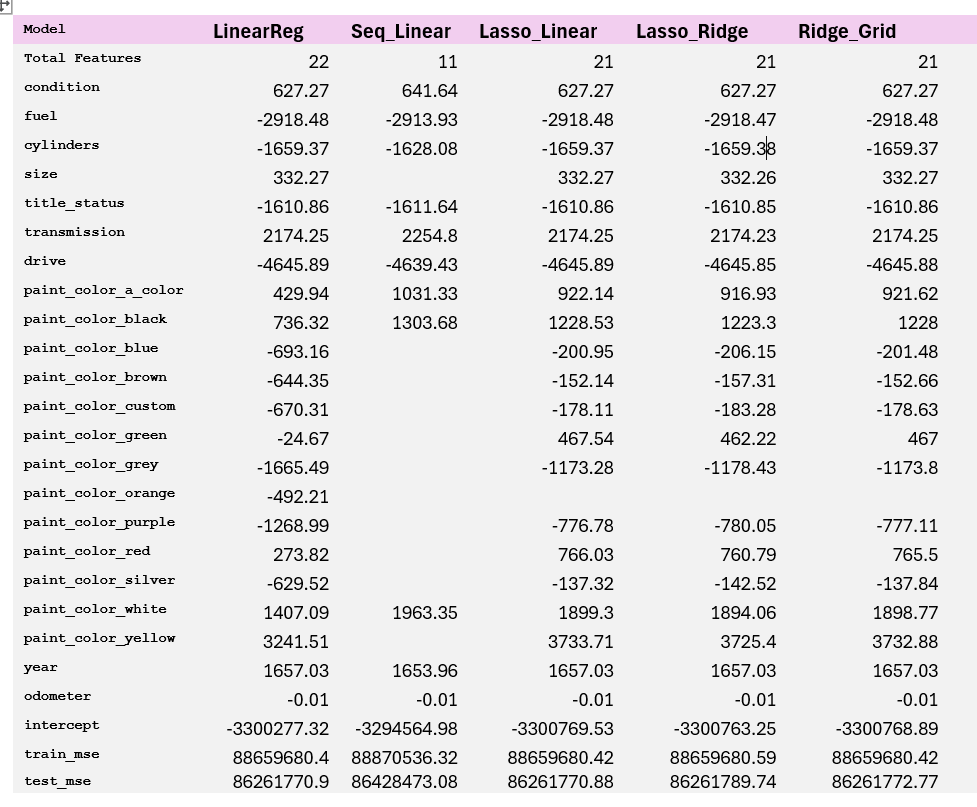

# Berkeley Machine Learning Course Application
## Project
This project was developed as part of my Berkeley Machine Learning course. Here dataset on car sales is analysed to predict price of car.

## Data Cleanup
The data set has 426880 entries and 18 features. Major features are: 
```
price
year
manufacturer
condition
cylinders
fuel
odometer
title_status
transmission
drive
size
type
paint_color
state
```
Most of the columns have missing values. There are 1,215,152 missing values in data. Some cars have price 0, which not make sense. So I used data with car prices from $1000 to $80,000. The sales information starts from year 1900. To make data more relevant, I used entries since year 2000.

Columns id and VIN are dropped, since they do not affect change in price. Region and State represent the same, so dropped Region.
'model' and size are similer, so dropped the model column.

#### Missing values were replaced with a value as below.
```
manufacturer: "a_company"
condition   : "good" 
cylinders   : "4 cylinders"
size        : "mid-size"
odometer    : 50000.0
fuel        : "gas"
title_status: "missing"
transmission: "other"
drive       : "rwd"
type        : "other"
paint_color : "a_color"
```
## Data analysis
Most of the data are catagorical in nature. To start with, the histogram shows the sales and their price range. Most of the cars sold are in price between 100 to 40,000.


The year and odometer are only numerical features in dataset. Thier relation with price is analyzed below:


The line plot on year vs price suggest that cars from recent years have higher price.


The scatter plot on odometer shows its lack of relationship on price.


The new and good condition cars have more sales. The boxplot below suggests that.


Cars with clean title have more sales.


The Four Wheel and Rear Wheel drives have higher sales.


Some interesting information were found from data. For example, California has high car sales. Cheverlot and Ford Manufacturers have sold most of cars. Toyota is on third place.


# Model Training
 For traininig and test purpose data is splited with 20% for testing.
 The categorical features are ordinal categories. They are encoded using OrdinalEncoder.  Car color is encoded with OneHotEncoder.

 Following models were explored.

### Model: Basic Linear Regression.

This model has coefficients of year, condition, size, transmission, yellow color and white color makes car price high.
Title, fuel, number of cylinder and grey color affects car price negatively.
Odomoter is not affected the price. 

The model has prediction error:
Train MSE:  88659680.42
Test  MSE:  86261770.88

### Model: Linear Regression with Sequential Feature Selection
The Sequential Feature selector helped to reduce number of features to 11.
Not sure why odometer is selected even though it has less effect on price.

The error on prediction remain close to basic linear regression model.

### Model: Linear Regression with Lasso Based Feature Selection

Not much different from Basic Linear Regression

### Model: Ridge Regression with Lasso Based Feature Selection
  
### Model: GridSearch and Cross validation on Rdige Regression
 



## Insights
Coupons 'Restaurant(<20)' and 'Carry out & Take away' have higher acceptance rate.
Drivers who already visited bar are likely to accept Bar coupons. Age above 30 is a factor. Also passanger being a kid also affecting decision to going to Bar.
Attributes like age, marital status, occupation does not seems much effect in accepting coupons.
